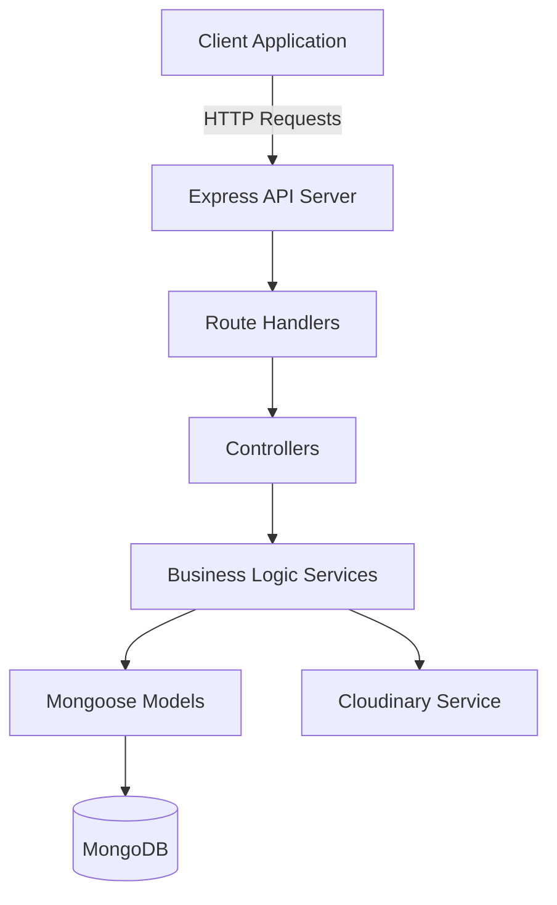

# Design Document: Drawing Document API

## Overview

The Drawing Document API is a RESTful Node.js/Express application that provides comprehensive document and image management capabilities for a drawing application. The system uses MongoDB for document storage and Cloudinary for image hosting, enabling users to create documents with ordered image collections, perform bulk operations, and retrieve images across multiple documents.

### Technology Stack

- **Runtime**: Node.js
- **Framework**: Express.js
- **Database**: MongoDB with Mongoose ODM
- **Image Storage**: Cloudinary
- **File Upload**: Multer middleware
- **Environment Management**: dotenv

## Architecture

### High-Level Architecture



### Layer Responsibilities

1. **Routes Layer**: Defines API endpoints and applies middleware
2. **Controllers Layer**: Handles HTTP request/response, validation, and error formatting
3. **Services Layer**: Contains business logic, orchestrates operations between database and Cloudinary
4. **Models Layer**: Defines data schemas and database interactions
5. **Middleware Layer**: Handles cross-cutting concerns (error handling, file uploads, validation)

## Components and Interfaces

### 1. Document Model

**Schema Definition:**

```javascript
{
  title: String (required, trimmed),
  description: String (required, trimmed),
  status: String (enum: ['active', 'deactive'], default: 'active'),
  images: [{
    cloudinaryId: String (required),
    url: String (required),
    order: Number (required)
  }],
  createdAt: Date (auto-generated),
  updatedAt: Date (auto-generated)
}
```

**Indexes:**
- Primary: `_id` (auto-generated)
- Secondary: `status` (for filtering)
- Secondary: `createdAt` (for sorting)

### 2. API Endpoints

#### Document Endpoints

| Method | Endpoint | Description | Request Body | Response |
|--------|----------|-------------|--------------|----------|
| POST | `/api/documents` | Create document | `{title, description, status?}` | Document object |
| GET | `/api/documents` | Get all documents | Query: `?status=active` | Array of documents |
| GET | `/api/documents/:id` | Get document by ID | - | Document object |
| PUT | `/api/documents/:id` | Update document | `{title?, description?, status?}` | Updated document |
| DELETE | `/api/documents/:id` | Delete document | - | Success message |

#### Image Endpoints

| Method | Endpoint | Description | Request Body | Response |
|--------|----------|-------------|--------------|----------|
| POST | `/api/documents/:id/images` | Upload single image | FormData: `image` | Updated document |
| POST | `/api/documents/:id/images/bulk` | Upload multiple images | FormData: `images[]` | Upload results |
| DELETE | `/api/documents/:id/images/:imageId` | Remove image | - | Updated document |
| DELETE | `/api/documents/:id/images` | Remove multiple images | `{imageIds: []}` | Updated document |
| PUT | `/api/documents/:id/images/reorder` | Reorder images | `{imageOrders: [{imageId, order}]}` | Updated document |
| GET | `/api/documents/:id/images` | Get document images | - | Array of images |
| POST | `/api/images/multi-document` | Get images from multiple docs | `{documentIds: []}` | Grouped images |

### 3. Service Components

#### DocumentService

**Responsibilities:**
- Document CRUD operations
- Business logic validation
- Coordinate with ImageService for cascading operations

**Key Methods:**
```javascript
- createDocument(data)
- getDocumentById(id)
- getAllDocuments(filters)
- updateDocument(id, data)
- deleteDocument(id)
```

#### ImageService

**Responsibilities:**
- Cloudinary integration
- Image upload/deletion
- Order management
- Multi-document image retrieval

**Key Methods:**
```javascript
- uploadSingleImage(documentId, file)
- uploadBulkImages(documentId, files)
- removeImage(documentId, imageId)
- removeMultipleImages(documentId, imageIds)
- reorderImages(documentId, orderData)
- getDocumentImages(documentId)
- getMultiDocumentImages(documentIds)
```

#### CloudinaryService

**Responsibilities:**
- Direct Cloudinary API interaction
- Upload configuration
- Resource deletion

**Key Methods:**
```javascript
- uploadImage(file, options)
- deleteImage(cloudinaryId)
- deleteBulkImages(cloudinaryIds)
```

### 4. Middleware Components

#### Upload Middleware (Multer)

**Configuration:**
- Storage: Memory storage for direct Cloudinary upload
- File filter: Accept only image types (jpeg, jpg, png, gif, webp)
- Size limit: 10MB per file
- Field configurations:
  - Single upload: `upload.single('image')`
  - Bulk upload: `upload.array('images', 20)` (max 20 images)

#### Error Handler Middleware

**Responsibilities:**
- Catch and format all errors
- Provide consistent error responses
- Log errors for debugging

**Error Response Format:**
```javascript
{
  success: false,
  error: {
    message: String,
    code: String,
    details?: Object
  }
}
```

#### Validation Middleware

**Responsibilities:**
- Validate request parameters
- Validate request body schemas
- Validate MongoDB ObjectIds

## Data Models

### Document Schema Details

```javascript
const documentSchema = new mongoose.Schema({
  title: {
    type: String,
    required: [true, 'Title is required'],
    trim: true,
    maxlength: [200, 'Title cannot exceed 200 characters']
  },
  description: {
    type: String,
    required: [true, 'Description is required'],
    trim: true,
    maxlength: [2000, 'Description cannot exceed 2000 characters']
  },
  status: {
    type: String,
    enum: {
      values: ['active', 'deactive'],
      message: 'Status must be either active or deactive'
    },
    default: 'active'
  },
  images: [{
    cloudinaryId: {
      type: String,
      required: true
    },
    url: {
      type: String,
      required: true
    },
    order: {
      type: Number,
      required: true
    }
  }]
}, {
  timestamps: true // Auto-generates createdAt and updatedAt
});
```

### Image Order Management Strategy

**Order Assignment Logic:**
1. New single image: `maxOrder + 1` or `1` if no images exist
2. Bulk upload: Sequential assignment starting from `maxOrder + 1`
3. Image removal: Reorder remaining images to maintain sequential order (1, 2, 3, ...)
4. Manual reorder: Validate uniqueness and update all affected images

**Reordering Algorithm:**
```
1. Validate all provided order values are unique
2. Validate all imageIds exist in document
3. Update each image's order value
4. Sort images array by order
5. Save document
```

## Error Handling

### Error Categories

1. **Validation Errors (400)**
   - Invalid request body
   - Invalid file types
   - Invalid order values
   - Missing required fields

2. **Not Found Errors (404)**
   - Document not found
   - Image not found

3. **Cloudinary Errors (500)**
   - Upload failures
   - Deletion failures
   - Network issues

4. **Database Errors (500)**
   - Connection failures
   - Query errors
   - Validation errors

### Error Handling Strategy

```javascript
// Centralized error handler
app.use((err, req, res, next) => {
  // Log error
  console.error(err);
  
  // Determine error type and status code
  const statusCode = err.statusCode || 500;
  const message = err.message || 'Internal server error';
  
  // Send formatted response
  res.status(statusCode).json({
    success: false,
    error: {
      message,
      code: err.code,
      ...(process.env.NODE_ENV === 'development' && { stack: err.stack })
    }
  });
});
```

### Cloudinary Failure Handling

**Single Upload Failure:**
- Return error immediately
- Do not modify document
- Provide clear error message

**Bulk Upload Partial Failure:**
- Continue processing remaining images
- Track successful and failed uploads
- Return detailed results:
```javascript
{
  success: true,
  data: {
    document: updatedDocument,
    uploadResults: {
      successful: 5,
      failed: 2,
      failures: [
        { filename: 'image1.jpg', error: 'Upload timeout' },
        { filename: 'image2.jpg', error: 'Invalid format' }
      ]
    }
  }
}
```

## Testing Strategy

### Unit Tests

**Models:**
- Schema validation
- Default values
- Custom methods

**Services:**
- Business logic functions
- Order calculation
- Error handling

**Utilities:**
- Helper functions
- Validation functions

### Integration Tests

**API Endpoints:**
- Document CRUD operations
- Image upload/removal
- Bulk operations
- Cross-document retrieval
- Error scenarios

**Database Operations:**
- Document creation/updates
- Image array manipulation
- Query filtering

**Cloudinary Integration:**
- Mock Cloudinary service
- Test upload/delete flows
- Test error scenarios

### Test Data Strategy

- Use test database separate from development
- Seed test documents before test suites
- Clean up after each test
- Use mock Cloudinary in tests (avoid actual uploads)

## Configuration and Environment

### Required Environment Variables

```
# Server
PORT=3000
NODE_ENV=development

# MongoDB
MONGODB_URI=mongodb://localhost:27017/drawing-api
MONGODB_TEST_URI=mongodb://localhost:27017/drawing-api-test

# Cloudinary
CLOUDINARY_CLOUD_NAME=your_cloud_name
CLOUDINARY_API_KEY=your_api_key
CLOUDINARY_API_SECRET=your_api_secret

# Upload Limits
MAX_FILE_SIZE=10485760
MAX_BULK_UPLOAD=20
```

### Cloudinary Configuration

```javascript
cloudinary.config({
  cloud_name: process.env.CLOUDINARY_CLOUD_NAME,
  api_key: process.env.CLOUDINARY_API_KEY,
  api_secret: process.env.CLOUDINARY_API_SECRET
});
```

### Upload Options

```javascript
{
  folder: 'drawing-app/documents',
  resource_type: 'image',
  allowed_formats: ['jpg', 'jpeg', 'png', 'gif', 'webp'],
  transformation: [
    { quality: 'auto' },
    { fetch_format: 'auto' }
  ]
}
```

## Performance Considerations

### Database Optimization

1. **Indexing:**
   - Index on `status` for filtered queries
   - Index on `createdAt` for sorting
   - Compound index on `status + createdAt` for common queries

2. **Query Optimization:**
   - Use projection to limit returned fields when full document not needed
   - Implement pagination for list endpoints
   - Use lean queries when Mongoose document methods not needed

### Cloudinary Optimization

1. **Parallel Uploads:**
   - Use `Promise.allSettled()` for bulk uploads
   - Process up to 5 images concurrently to avoid rate limits

2. **Image Optimization:**
   - Enable automatic format selection
   - Enable automatic quality optimization
   - Use responsive image transformations

### API Response Optimization

1. **Pagination:**
```javascript
GET /api/documents?page=1&limit=20
```

2. **Field Selection:**
```javascript
GET /api/documents?fields=title,status,createdAt
```

3. **Response Caching:**
   - Cache document lists with short TTL
   - Invalidate cache on document updates

## Security Considerations

### Input Validation

- Sanitize all user inputs
- Validate file types and sizes
- Validate MongoDB ObjectIds
- Prevent NoSQL injection

### File Upload Security

- Validate file MIME types
- Limit file sizes
- Scan for malicious content (future enhancement)
- Use secure Cloudinary URLs

### API Security (Future Enhancements)

- Implement authentication (JWT)
- Implement authorization (role-based)
- Rate limiting
- CORS configuration
- Request size limits

## Deployment Considerations

### Environment Setup

1. Production MongoDB with replica set
2. Cloudinary production account with appropriate limits
3. Environment variables securely managed
4. Logging and monitoring setup

### Scalability

- Stateless API design enables horizontal scaling
- MongoDB sharding for large datasets
- Cloudinary CDN handles image delivery
- Load balancer for multiple API instances

## Future Enhancements

1. **Image Metadata:**
   - Store image dimensions
   - Store file size
   - Store upload timestamp

2. **Advanced Features:**
   - Image transformations (crop, resize)
   - Image versioning
   - Document templates
   - Collaborative editing

3. **Performance:**
   - Redis caching layer
   - Background job processing for bulk operations
   - Webhook notifications for async operations

4. **Security:**
   - User authentication and authorization
   - Document sharing and permissions
   - API rate limiting
   - Audit logging
