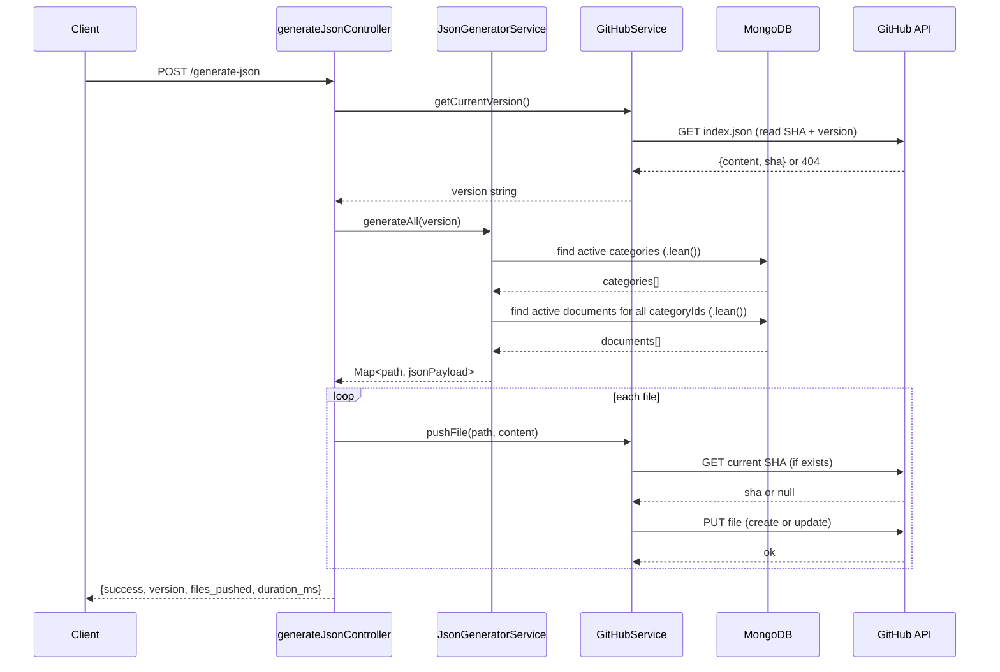

# Design Document: JSON GitHub Publisher

## Overview

The JSON GitHub Publisher adds a single `POST /generate-json` endpoint to the existing Express/MongoDB backend. It reads active categories and documents from MongoDB, builds a set of static JSON files in memory, and pushes them to a GitHub repository via the GitHub Contents REST API. The system auto-increments the semver patch version by reading the current `index.json` from GitHub before writing, and skips files whose content has not changed to avoid unnecessary commits.

The feature is implemented as three new modules that follow the existing codebase conventions (class-based services, CommonJS, async/await, `.lean()` queries):

- `helpers/imageResolver.js`
- `helpers/paginationHelper.js`
- `services/JsonGeneratorService.js`
- `services/GitHubService.js`
- `controllers/generateJsonController.js`
- `routes/generateJson.js` (wired into the existing `routes/index.js`)

---

## Architecture



---

## Components and Interfaces

### `helpers/imageResolver.js`

```js
/**
 * Resolves the display image URL for a lean document object.
 * @param {Object} doc - Lean document with main_image and images fields
 * @returns {string|null}
 */
function resolveImage(doc) { ... }

module.exports = { resolveImage };
```

### `helpers/paginationHelper.js`

```js
const PAGE_SIZE = 50;

/**
 * Splits an array into pages of PAGE_SIZE.
 * @param {Array} items
 * @returns {{ pages: Array<Array>, totalPages: number }}
 */
function paginate(items) { ... }

module.exports = { paginate, PAGE_SIZE };
```

### `services/GitHubService.js`

```js
class GitHubService {
  constructor()                                    // reads env vars, sets base URL
  async getFile(path)                              // GET /repos/{owner}/{repo}/contents/{path}
                                                   // returns { content: string, sha: string } or null
  async pushFile(path, jsonPayload)                // encodes, compares, PUT if changed
  async getCurrentVersion()                        // reads index.json, parses version
  _incrementVersion(version)                       // "1.0.3" → "1.0.4"
  _encode(obj)                                     // JSON.stringify → base64
}

module.exports = new GitHubService();
```

### `services/JsonGeneratorService.js`

```js
class JsonGeneratorService {
  async generateAll(version)
  // Returns Map<string, object>:
  //   "index.json"
  //   "categories.json"
  //   "data/{slug}.json"          (one per category)
  //   "data/{slug}/page-{n}.json" (one per page per category)
  //   "config/app-config.json"

  _buildIndex(version)
  _buildCategories(categories, docsByCategoryId)
  _buildCategoryIndex(category, docs)
  _buildPages(category, docs)
  _buildConfig(version)
}

module.exports = new JsonGeneratorService();
```

### `controllers/generateJsonController.js`

```js
const generateJson = async (req, res) => {
  const start = Date.now();
  try {
    const version = await githubService.getCurrentVersion();
    const files   = await jsonGeneratorService.generateAll(version);
    let pushed = 0, skipped = 0;
    for (const [path, payload] of files) {
      const changed = await githubService.pushFile(path, payload);
      changed ? pushed++ : skipped++;
    }
    res.json({ success: true, version, files_pushed: pushed, files_skipped: skipped, duration_ms: Date.now() - start });
  } catch (err) {
    console.error('[generate-json] error:', err);
    res.status(500).json({ success: false, error: err.message });
  }
};
```

---

## Data Models

### MongoDB Queries

**Categories** (single query):
```js
Category.find({ status: 'active' })
  .select('_id name slug icon description')
  .sort({ displayOrder: 1, name: 1 })
  .lean()
```

**Documents** (single bulk query — avoids N+1):
```js
Document.find({ status: 'active', category: { $in: categoryIds } })
  .select('_id title category main_image images createdAt')
  .sort({ createdAt: -1 })
  .lean()
```

Documents are then grouped in memory by `category.toString()` into a `Map<categoryId, doc[]>`.

### In-Memory Shape (lean document)

```js
{
  _id: ObjectId,
  title: String,
  category: ObjectId,
  main_image: { cloudinaryId: String|null, url: String|null },
  images: [{ cloudinaryId, url, order }],
  createdAt: Date
}
```

### Generated File Shapes

See Requirements §5–9 for exact JSON structures. All `_id` / `category` ObjectIds are converted with `.toString()`.

---

## Correctness Properties

*A property is a characteristic or behavior that should hold true across all valid executions of a system — essentially, a formal statement about what the system should do. Properties serve as the bridge between human-readable specifications and machine-verifiable correctness guarantees.*

### Property 1: Image resolver returns main_image.url when present

*For any* document object where `main_image.url` is a non-empty string, `resolveImage(doc)` should return exactly that string.

**Validates: Requirements 4.1**

---

### Property 2: Image resolver falls back to first ordered image

*For any* document object where `main_image.url` is absent/null and `images` is a non-empty array, `resolveImage(doc)` should return the `url` of the element with the lowest `order` value.

**Validates: Requirements 4.2**

---

### Property 3: Image resolver returns null when no images exist

*For any* document object where both `main_image.url` is absent and `images` is empty or absent, `resolveImage(doc)` should return `null`.

**Validates: Requirements 4.3**

---

### Property 4: Pagination splits into correct page count

*For any* array of N items, `paginate(items).totalPages` should equal `Math.ceil(N / 50)`, and the sum of all page lengths should equal N.

**Validates: Requirements 8.1**

---

### Property 5: has_more is consistent with page position

*For any* paginated result, a page file's `has_more` field should be `true` if and only if it is not the last page (i.e., `page < totalPages`).

**Validates: Requirements 8.2**

---

### Property 6: Version auto-increment increments patch

*For any* valid semver string `"X.Y.Z"`, `_incrementVersion("X.Y.Z")` should return `"X.Y.(Z+1)"`.

**Validates: Requirements 5.2**

---

### Property 7: categories.json total matches data array length

*For any* generated `categories.json`, `total` should equal `data.length`.

**Validates: Requirements 6.1**

---

### Property 8: Preview contains at most 3 items

*For any* category entry in `categories.json`, `preview.length` should be ≤ 3.

**Validates: Requirements 6.3**

---

### Property 9: Page data items contain only id, title, image

*For any* page file, every item in `data` should have exactly the keys `id`, `title`, and `image` — no extra fields.

**Validates: Requirements 8.2**

---

## Error Handling

| Scenario | Behaviour |
|---|---|
| MongoDB query fails | Error propagates to controller → 500 response |
| GitHub API returns non-2xx | GitHubService throws with path + status code |
| `index.json` missing on GitHub | Version defaults to `"1.0.0"` |
| Missing env vars (`GITHUB_TOKEN` etc.) | GitHubService constructor throws at startup |
| File content unchanged | Skipped silently, counted in `files_skipped` |

---

## Testing Strategy

### Unit Tests (Jest)

- `imageResolver`: test all three branches (main_image present, fallback, null)
- `paginationHelper`: test empty array, exactly 50 items, 51 items, 100 items, 101 items
- `GitHubService._incrementVersion`: test patch increment, boundary values
- `JsonGeneratorService._buildCategories`: test `total` equals category count, preview ≤ 3

### Property-Based Tests (fast-check)

fast-check is the standard PBT library for JavaScript/Node.js. Each property test runs a minimum of 100 iterations.

- **Property 1** — `fc.record({ main_image: fc.record({ url: fc.string({ minLength: 1 }) }), images: fc.array(...) })` → assert `resolveImage(doc) === doc.main_image.url`
- **Property 2** — generate docs with null main_image and non-empty images array → assert result equals min-order url
- **Property 3** — generate docs with null main_image and empty images → assert result is null
- **Property 4** — `fc.array(fc.anything())` → assert `paginate(arr).totalPages === Math.ceil(arr.length / 50)` and sum of page lengths equals arr.length
- **Property 5** — same generator → assert `has_more === (page < totalPages)` for every page
- **Property 6** — `fc.tuple(fc.nat(), fc.nat(), fc.nat())` → assert patch increments by 1
- **Properties 7–9** — generate random category/document arrays, call builder functions, assert structural invariants

Tag format for each test: `// Feature: json-github-publisher, Property N: <property_text>`

Each correctness property is implemented by a single property-based test.
